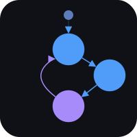

<h1 align="center">
  <a></a>
  <br>
  Statechart
</h1>

<p align="center">
  <b>Hierarchical State Machine (HSM) library for Arduino with zero dynamic memory allocation.</b>
</p>

<p align="center">
  <a href="https://www.ardu-badge.com/Statechart">
    
  </a>
  <a href="https://registry.platformio.org/libraries/alkonosst/Statechart">
    
  </a>
  <br><br>
  <a href="https://opensource.org/licenses/MIT">
    
  </a>
  <br><br>
  <a href="https://ko-fi.com/alkonosst">
    
  </a>
</p>

---

# Table of contents <!-- omit in toc -->

- [Description](#description)
- [Key Features](#key-features)
- [Quick Example](#quick-example)
- [Installation](#installation)
  - [PlatformIO](#platformio)
  - [Arduino IDE](#arduino-ide)
- [Usage](#usage)
  - [Including the library](#including-the-library)
  - [Namespace](#namespace)
  - [Defining States and Events](#defining-states-and-events)
  - [Creating an HSM Instance](#creating-an-hsm-instance)
  - [Registering States](#registering-states)
  - [Composite States and Hierarchy](#composite-states-and-hierarchy)
  - [Transitions](#transitions)
    - [Simple transition](#simple-transition)
    - [Transition with action](#transition-with-action)
    - [Transition with guard](#transition-with-guard)
    - [Transition with guard and action](#transition-with-guard-and-action)
    - [Guard fallthrough (multiple transitions for the same event)](#guard-fallthrough-multiple-transitions-for-the-same-event)
    - [Internal transitions](#internal-transitions)
  - [History](#history)
    - [Shallow history](#shallow-history)
    - [Deep history](#deep-history)
  - [Event Inheritance](#event-inheritance)
  - [Running the Machine](#running-the-machine)
  - [Querying State](#querying-state)
  - [Resetting](#resetting)
  - [Optimization](#optimization)
  - [Logging](#logging)
    - [Configuration macros](#configuration-macros)
- [Release Status](#release-status)
- [License](#license)

---

# Description

**Statechart** is an Arduino library for building Hierarchical State Machines (HSMs) in C++11. States, transitions, guards, and actions are registered once in `setup()` using a fluent builder API. Events are dispatched at runtime via `dispatch()`.

The library follows UML statechart semantics: composite states with initial children, shallow and deep history, event inheritance up the parent chain, and proper LCA-based exit/entry ordering. All storage is statically allocated at compile time through template parameters; there is no dynamic memory allocation.

# Key Features

- **Zero dynamic allocation** - All storage is embedded in the `HSM<>` template; no `new` or `malloc` anywhere.
- **Fluent builder API** - States are configured with chainable `addState().onEnter().onExit().on().onInternal()` calls.
- **Composite states** - Unlimited nesting depth via `parent()` and `initial()`.
- **Guards** - Per-transition guards (`bool` lambdas or function pointers) that allow or deny transitions at runtime.
- **Guard fallthrough** - Multiple transitions for the same event, evaluated in registration order; first passing guard wins.
- **Internal transitions** - React to an event without changing state or triggering exit/entry callbacks.
- **Event inheritance** - Events bubble up the parent chain automatically; define `on(Reset, ...)` once on a parent and all children handle it.
- **Shallow history `[H]`** - Saves the last active direct child on exit; restores it on re-entry.
- **Deep history `[H*]`** - Restores the full nested path down to the leaf on re-entry.
- **Function pointers or `std::function`** - `#define STATECHART_NO_STD_FUNCTION` replaces
  `std::function` with raw function pointers for optional optimization.
- **Configurable logging** - Five log levels (`Error` through `Verbose`) with optional ESP32 ESP-IDF log integration.

# Quick Example

A traffic light cycling through Red, Green, and Yellow:

```cpp
#include <Arduino.h>
#include <Statechart.h>
using namespace Statechart;

// Define your states and events as enum classes with uint8_t underlying type for compact storage.
enum class State : uint8_t { Red, Green, Yellow };
enum class Event : uint8_t { Next };

// Create an HSM instance with template parameters: <StateType, EventType, MaxStates, MaxTransitions>
HSM<State, Event, 3, 3> hsm("TrafficLight", State::Red);

void setup() {
  Serial.begin(115200);

  // Setup states
  hsm.addState(State::Red)
    .onEnter([] { Serial.println("RED - stop"); })
    .on(Event::Next, State::Green);

  hsm.addState(State::Green)
    .onEnter([] { Serial.println("GREEN - go"); })
    .on(Event::Next, State::Yellow);

  hsm.addState(State::Yellow)
    .onEnter([] { Serial.println("YELLOW - caution"); })
    .on(Event::Next, State::Red);

  // Validate HSM and start it
  if (!hsm.isValid()) { while (true); }
  hsm.start();

  // Dispatch events to cycle through the states
  hsm.dispatch(Event::Next); // Red    -> Green
  hsm.dispatch(Event::Next); // Green  -> Yellow
  hsm.dispatch(Event::Next); // Yellow -> Red
}

void loop() {}
```

# Installation

## PlatformIO

Add to your `platformio.ini`:

```ini
[env:your_env]
; Most recent changes
lib_deps =
  https://github.com/alkonosst/Statechart.git

; Pinned release (recommended for production)
lib_deps =
  https://github.com/alkonosst/Statechart.git#vx.y.z
```

## Arduino IDE

1. Open Arduino IDE.
2. Go to **Sketch > Manage Libraries...**
3. Search for **"Statechart"**.
4. Click **Install**.

# Usage

## Including the library

A single header includes everything:

```cpp
#include <Statechart.h>
```

## Namespace

All public types live in the `Statechart` namespace:

```cpp
using namespace Statechart;
```

## Defining States and Events

Use `enum class` with `uint8_t` as the underlying type. This keeps each value to one byte, which matters on resource-constrained microcontrollers:

```cpp
enum class State : uint8_t { Idle, Running, Fault };
enum class Event : uint8_t { Start, Stop, FaultDetected };
```

## Creating an HSM Instance

The `HSM` template takes four parameters: state type, event type, maximum number of states, and maximum number of transitions across all states:

```cpp
// HSM instance: template parameters are <StateType, EventType, MaxStates, MaxTransitions>
// How to choose MaxStates and MaxTransitions:
//   - MaxStates: total number of states in the machine
//   - MaxTransitions: total number of transitions across all states; every on() call adds one
HSM<State, Event, 3, 4> hsm("MyMachine", State::Idle);
```

If `MaxStates` or `MaxTransitions` is exceeded during `addState()` calls, `isValid()` returns `false` and `start()` is a no-op.

## Registering States

Call `addState()` once per state, then chain builder methods. Call this during `setup()` before `start()`:

```cpp
// On Event::Start, transition from Idle to Running, printing messages on entry and exit.
hsm.addState(State::Idle)
  .onEnter([] { Serial.println("Idle"); })
  .onExit([] { Serial.println("Leaving Idle"); })
  .on(Event::Start, State::Running);
```

| Builder method                      | Description                                                                      |
| ----------------------------------- | -------------------------------------------------------------------------------- |
| `.onEnter(fn)`                      | Called when entering this state.                                                 |
| `.onExit(fn)`                       | Called when exiting this state.                                                  |
| `.on(event, target)`                | External transition to `target` on `event`.                                      |
| `.on(event, target, action)`        | External transition with an action (side effect). The callable must be `void()`. |
| `.on(event, target, guard)`         | External transition with a guard (validator). The callable must be `bool()`.     |
| `.on(event, target, guard, action)` | External transition with both.                                                   |
| `.onInternal(event, action)`        | Internal transition: runs action, no state change, no exit/entry.                |
| `.onInternal(event, guard, action)` | Internal transition with guard.                                                  |
| `.parent(state)`                    | Sets the parent for hierarchical nesting.                                        |
| `.initial(state)`                   | Sets the initial child for composite states.                                     |
| `.withHistory()`                    | Enables shallow history `[H]`.                                                   |
| `.withDeepHistory()`                | Enables deep history `[H*]`.                                                     |

## Composite States and Hierarchy

A composite state groups child states. When the machine transitions into a composite state, it automatically descends into the initial child (or the history child if history is enabled):

```cpp
// Active is a composite state with Idle as the initial child.
// PowerOff is defined once on Active and inherited by all children.
hsm.addState(State::Active)
  .initial(State::Idle)
  .on(Event::PowerOff, State::Standby);

hsm.addState(State::Idle)
  .parent(State::Active)
  .on(Event::Work, State::Working);

hsm.addState(State::Working)
  .parent(State::Active);
```

## Transitions

### Simple transition

```cpp
// On Event::Start, transition from Idle to Running.
hsm.addState(State::Idle)
  .on(Event::Start, State::Running);
```

### Transition with action

The action is a `void()` callable that runs after the source exits and before the target enters:

```cpp
// On Event::Start, transition from Idle to Running and print a message.
hsm.addState(State::Idle)
  .on(Event::Start, State::Running, [] { Serial.println("Starting..."); });
```

### Transition with guard

The guard is a `bool()` callable. If it returns `false`, the transition is not taken:

```cpp
static bool ready = false;

// On Event::Start, transition from Idle to Running only if ready is true.
hsm.addState(State::Idle)
  .on(Event::Start, State::Running, [] { return ready; });
```

### Transition with guard and action

```cpp
// On Event::Start, transition from Idle to Running if ready is true, and print a message.
hsm.addState(State::Idle)
  .on(Event::Start, State::Running,
    [] { return ready; },
    [] { Serial.println("Starting..."); });
```

### Guard fallthrough (multiple transitions for the same event)

Register multiple `.on()` calls for the same event. The first transition whose guard passes is taken. If all guards fail, `dispatch()` returns `false`:

```cpp
static int retry_count = 0;

hsm.addState(State::Sending)
  // First try: retry up to 3 times
  .on(Event::Fail, State::Idle,
    [] { return ++retry_count <= 3; },
    [] { Serial.printf("Retry %d/3\n", retry_count); })
  // Fallback: all retries exhausted
  .on(Event::Fail, State::Error, [] { Serial.println("Max retries"); });
```

### Internal transitions

An internal transition runs an action in response to an event without exiting or entering any state and without changing `getCurrentState()`. Internal transitions are also subject to event inheritance, so they can be defined on a parent and fired from any child:

```cpp
static uint32_t heartbeat = 0;

// On Event::Heartbeat, increment the heartbeat counter.
hsm.addState(State::Operational)
  .onInternal(Event::Heartbeat, [] { heartbeat++; }); // inherited by all children

// With guard:
hsm.addState(State::Held)
  .onInternal(Event::HoldTimeout,
    [] { return auto_repeat_enabled; },
    [] { /* fire repeat action */ });
```

## History

### Shallow history

Use `withHistory()` when a composite state has sibling children and you want to resume whichever one was active last time, rather than always restarting from the initial child.

`withHistory()` saves the last active **direct** child every time the composite is exited, and restores it on the next re-entry. If the composite has never been exited (no history saved yet), the first re-entry falls back to `initial()`.

```cpp
// Example: audio player with Normal and Shuffle modes.
// If the user was in Shuffle and a call interrupts, resuming should
// go back to Shuffle, not restart from Normal every time.

// States: Playing (composite), Normal, Shuffle, Suspended
// Events: Shuffle, Suspend, Resume

hsm.addState(State::Playing)
  .initial(State::Normal)     // first entry always starts here
  .withHistory()              // [H]: subsequent entries resume the last active child
  .on(Event::Suspend, State::Suspended);

hsm.addState(State::Normal)
  .parent(State::Playing)
  .on(Event::Shuffle, State::Shuffle);

hsm.addState(State::Shuffle)
  .parent(State::Playing);

hsm.addState(State::Suspended)
  .on(Event::Resume, State::Playing); // re-enters Playing -> history restored

// Sequence:
//   start()            -> Playing -> Normal    (no history yet: initial child)
//   dispatch(Shuffle)  -> Shuffle              (normal transition within composite)
//   dispatch(Suspend)  -> Suspended            (exits Playing: saves H = Shuffle)
//   dispatch(Resume)   -> Playing -> Shuffle   (history restored)
//   dispatch(Suspend)  -> Suspended            (exits Playing: saves H = Shuffle again)
//   dispatch(Resume)   -> Playing -> Shuffle   (history restored again)
//   reset()            ->                      (clears all history)
//   dispatch(Resume)   -> Playing -> Normal    (no history: back to initial)
```

### Deep history

Use `withDeepHistory()` when a composite state contains **nested** composites and you want to restore the exact leaf state across all levels, not just the top-level child.

`withDeepHistory()` saves the full path from the composite down to the active leaf. On re-entry it restores every level in sequence. Both shallow and deep history are updated on every exit and restored on every re-entry. The difference is only depth: `withHistory()` restores the last active **direct** child, while `withDeepHistory()` restores the full nested path down to the leaf.

```cpp
// Example: temperature controller with a multi-phase Running process.
// If a fault interrupts mid-cycle, recovery should resume the exact
// phase that was active, not restart the entire cycle from Heating.

// States: Running (composite), Heating (composite), Phase1, Phase2, Cooling, Fault
// Events: FaultDetected, FaultCleared

hsm.addState(State::Running)
  .initial(State::Heating)    // first entry descends into Heating
  .withDeepHistory();         // [H*]: subsequent entries restore the full saved path

hsm.addState(State::Heating)
  .parent(State::Running)
  .initial(State::Phase1)     // Heating itself is also a composite
  .on(Event::HeatDone, State::Cooling);

hsm.addState(State::Phase1)
  .parent(State::Heating)
  .on(Event::Phase1Done, State::Phase2);

hsm.addState(State::Phase2)
  .parent(State::Heating);

hsm.addState(State::Cooling)
  .parent(State::Running);

hsm.addState(State::Fault)
  .on(Event::FaultCleared, State::Running); // re-enters Running -> deep history applies

// Sequence:
//   start()               -> Running -> Heating -> Phase1  (initial chain)
//   dispatch(Phase1Done)  -> Phase2                        (within Heating)
//   dispatch(FaultDetect) -> Fault    (exits Phase2/Heating/Running; saves Phase2 path)
//   dispatch(FaultCleared)-> Running -> Heating -> Phase2  (full path restored)
//   dispatch(FaultDetect) -> Fault    (saves Phase2 again; deep history is persistent)
//   dispatch(FaultCleared)-> Running -> Heating -> Phase2  (still restores Phase2)
```

## Event Inheritance

If the current state does not handle an event, it propagates up the parent chain. This lets shared behavior be defined once on a composite parent:

```cpp
// Reset and SimFail defined once on Online; inherited by Idle, Registering, Connected, etc.
hsm.addState(State::Online)
  .on(Event::Reset, State::PowerOff)
  .on(Event::SimFail, State::PowerOff);

hsm.addState(State::Idle)
  .parent(State::Online); // inherits Reset and SimFail automatically
```

## Running the Machine

After all `addState()` calls, validate and start the machine:

```cpp
// Checks for construction overflow (MaxStates or MaxTransitions exceeded).
if (!hsm.isValid()) {
  Serial.println("HSM sizing invalid!");
  while (true);
}

// Runs the entry chain for the initial state.
hsm.start();

// Optional: prints the full state and transition configuration.
// Requires STATECHART_LOG_LEVEL >= 3 (Info).
hsm.debugDump();
```

Dispatch events from `loop()` or any normal task context:

```cpp
void loop() {
  if (buttonPressed())   hsm.dispatch(Event::Down);
  if (buttonReleased())  hsm.dispatch(Event::Up);
}
```

> [!CAUTION]
> Do not call `dispatch()` from an interrupt handler (ISR). It executes user callbacks (`onEnter`, `onExit`, guards, actions), uses logging functions, and allocates temporary arrays on the stack — none of which are ISR-safe. Instead, set a flag or enqueue the event in the ISR and process it in `loop()`:
>
> ```cpp
> volatile MyEvent pending_event;
> volatile bool has_event = false;
>
> void IRAM_ATTR my_isr() {
>   pending_event = MyEvent::ButtonPressed;
>   has_event = true;
> }
>
> void loop() {
>   if (has_event) {
>     has_event = false;
>     hsm.dispatch(pending_event);
>   }
> }
> ```
>
> For multiple concurrent event sources, use a FreeRTOS `QueueHandle_t` instead of a single flag.

`dispatch()` returns `true` if a transition was taken, `false` if the event was not handled by any state in the hierarchy.

## Querying State

```cpp
// Returns the currently active leaf state.
State s = hsm.getCurrentState();

// Returns true if the machine is in the given state or any of its substates.
bool in_running = hsm.isInState(State::Running);

// Returns true if start() has been called.
bool started = hsm.hasStarted();
```

## Resetting

`reset()` exits the current state chain, clears all saved history, and re-enters the initial state. Calling it before `start()` is a no-op:

```cpp
hsm.reset(); // back to initial state, all history cleared
```

## Optimization

By default, the library uses `std::function` to store guards and actions, which allows for flexible
lambdas with captures, but it uses more memory. If you want to avoid the `std::function` memory
overhead and guarantee zero dynamic allocation (_not using captures_), you can enable function
pointers by defining `STATECHART_NO_STD_FUNCTION` **before** including the library (_or in
build_flags in platformio.ini_). This replaces `std::function` with raw function pointers (`void(*)()`
for actions and `bool(*)()` for guards). The trade-off is that you can only use plain free functions
or non-capturing lambdas as callbacks; any lambda with captures will fail to compile.

In platformio.ini:

```ini
[env:your_env]
build_flags = -DSTATECHART_NO_STD_FUNCTION
```

In code:

```cpp
// Must appear before the #include
#define STATECHART_NO_STD_FUNCTION
#include <Statechart.h>

// All callbacks must be free functions or non-capturing lambdas.
bool isReady()      { return pipe_primed; }
void onStart()      { Serial.println("Starting"); }

hsm.addState(State::Off)
  .on(Event::Start, State::Running, isReady, onStart);
```

## Logging

The library emits diagnostic messages through a compile-time log level. The default level is `0` (silent). All log output goes through `STATECHART_LOGE/W/I/D/V` macros defined in `StatechartLogs.h`.

### Configuration macros

Define these **before** including the library or in platformio.ini:

```ini
[env:your_env]
; Info
build_flags = -DSTATECHART_LOG_LEVEL=3
```

| Macro                       | Default        | Description                                                                        |
| --------------------------- | -------------- | ---------------------------------------------------------------------------------- |
| `STATECHART_LOG_LEVEL`      | `0`            | Log verbosity: `0`=None, `1`=Error, `2`=Warning, `3`=Info, `4`=Debug, `5`=Verbose. |
| `STATECHART_LOG_SERIAL`     | `Serial`       | Output stream for non-ESP32 platforms.                                             |
| `STATECHART_LOG_TAG`        | `"Statechart"` | Tag string prepended to every log line.                                            |
| `STATECHART_USE_ESP32_LOGS` | `1`            | When `1` on ESP32, routes output through `ESP_LOGx()` instead of `Serial`.         |

> [!NOTE]
> `debugDump()` requires `STATECHART_LOG_LEVEL >= 3` to produce output.

# Release Status

This project is in active development. Until reaching version **v1.0.0**, consider it **beta software**. APIs may change in future releases, and some features may be incomplete or unstable. Please report any issues on the [GitHub Issues](https://github.com/alkonosst/Statechart/issues) page.

# License

This project is licensed under the MIT License - see the [LICENSE](LICENSE) file for details.
